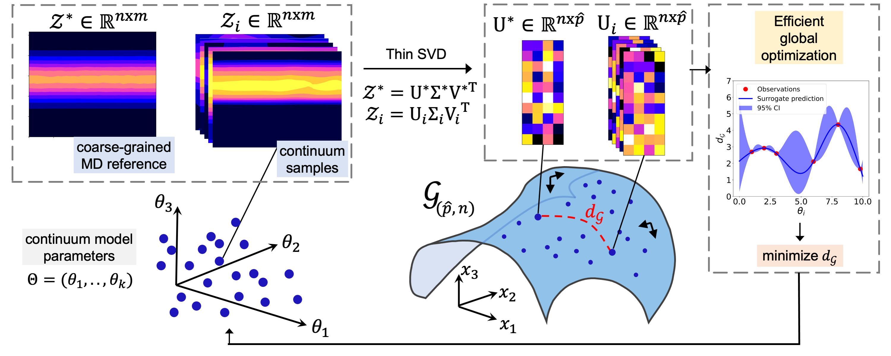

## Table of contents
* [General info](#general-info)
* [Methods](#methods)
* [Application](#application)
* [Contents](#contents)

## General info

This Git repository contains python and C++ codes for calibrating the stochastic input parameters of a continuum model based on data from an atomistic simulation.
A novel coarse-grained methodology called **Grassmannian EGO** is employed.

## Methods
Grassmannian EGO uses concepts from manifold learning 
(nonlinear dimensionallity reduction), regression analysis (Gaussian Process regression) and Bayesian optimization (Efficient global optimization). An optimal set of stochastic input parameters is identified which results in matching the behavior of the continuum model with the MD data. Grassmannian EGO is capable of bridging the scales between multiscale models and result in a significant reduction of the computational cost by allowing 
continuum model simulations consistent with atomic-level detailed simulations.

Details of the methdology can be found here: https://arxiv.org/abs/2103.00779

*Authors: Katiana Kontolati, Darius Alix-Williams, Nicholas M. Boffi, Michael L. Falk, Chris H. Rycroft, Michael D. Shields*

A graphical abstract of the proposed approach is provided below:

## Application

Molecular dynamics simulation is performed with LAMMPS for a 50-50 CuZr metallic glass system.
Grassmannian EGO is employed for the calibration of a continuum model, used for simulating plastic deformation in metallic glasses (amorphous solids) based on 
the **Shear Transformation Zone** theory of plasticity. 
 
## Contents

* _CuZr_Ref_ - contains the reference MD data in the form of binary files. In particular, shear-strain (Exy.MD.#) and potential energy (pe.MD.#) files are provided in 
100 simulation steps. In addition the scalar mean stress values are provided in the txt file (6th column).

* _validation.py_ - python code for validating the Grassmannian EGO methdology. In this case, reference data are produced by a forward evaluation of the continuum model.
The algorithm is then employed to 'find' the parameters used to produce the continuum response.

* _application.py_ - python code for calibration of the STZ continuum model based on the MD data (CuZr_Ref directory) for the CuZr metallic glass. 

* _shear_energy.cc_ - C++ code used to simulate the STZ model developed by the Rycroft Group @ Harvard. More information on how to compile and run this code can
be found here: https://github.com/SURGroup/STZ

### Contact
For more information or questions please email me at: kontolati@jhu.edu

